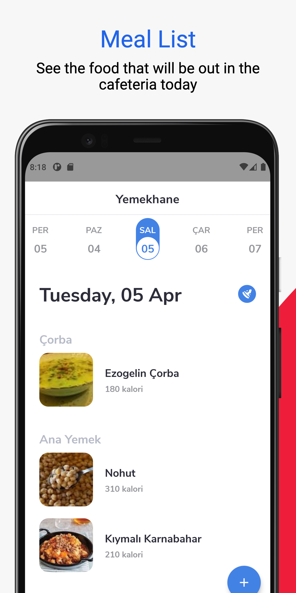
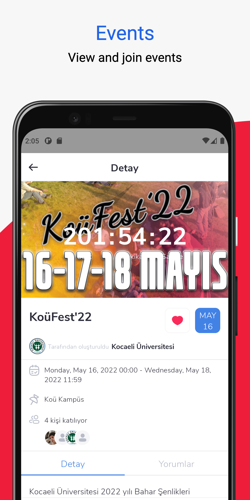
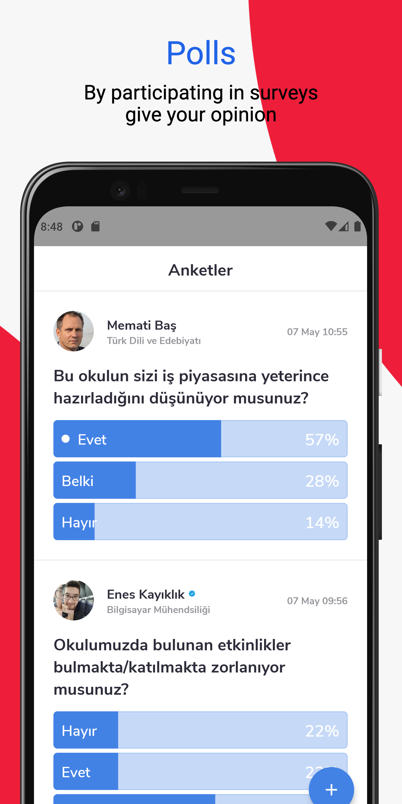
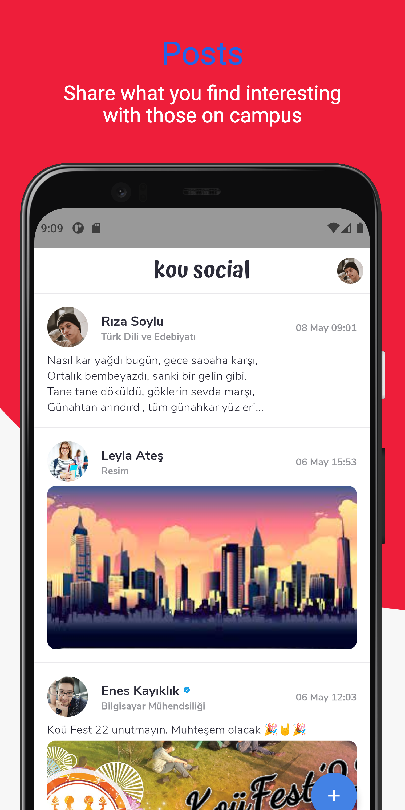
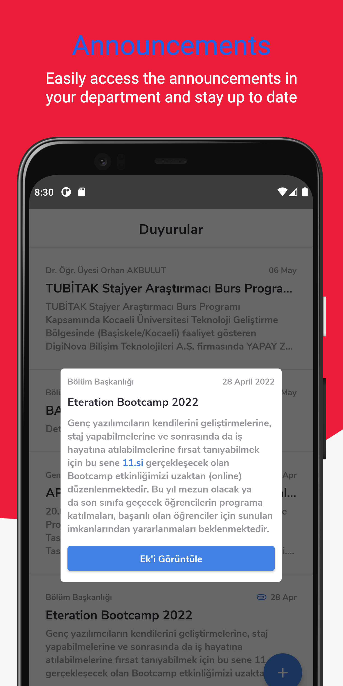

# KOU Social 🎓

University social media and event app Demonstrate the Jetpack Compose UI
using [Firebase](https://firebase.google.com/) as Database. *Made with ❤️
by [Enes](https://github.com/Enes-Kayiklik)*

<a href='https://play.google.com/store/apps/details?id=com.eneskayiklik.eventverse'></a>

## UI Inspirations 🎨

***[Polls](https://dribbble.com/shots/14142444-Tripadvisor-Community-Questions) item by [Jonah Grindler](https://dribbble.com/Jonahgrindler)***

***[Meal List](https://dribbble.com/shots/11548969-Food-Recipes-App/attachments/3169653?mode=media) by [simantOo](https://dribbble.com/simantoo)***

***[Create Poll](https://dribbble.com/shots/4526021-SN-Kit-News-feed-Create-post) by [Damir](https://dribbble.com/biomax)***

***[Profile](https://dribbble.com/shots/15809819-Login-Account-Truck-Manager) by [Evgen Kuznetsov](https://dribbble.com/bucklajean)***

***[Settings](https://dribbble.com/shots/15437594-App-Settings) by [Den Klenkov](https://dribbble.com/denklenkov)***

## Beautiful icon pack 📦
***[Pela Icon](https://www.figma.com/community/file/990314173893326792) by [PelaTeam](https://www.figma.com/@pelateam)***

## Architecture 🗼

- Single Activity No Fragment
- MVVM Pattern

**View:** Renders UI and delegates user actions to ViewModel

**ViewModel:** Can have simple UI logic but most of the time just gets the data from UseCase.

**UseCase:** Contains all business rules and they written in the manner of single responsibility
principle.

**Repository:** Single source of data. Responsible to get data from one or more data sources.

**For more information you can
check [Guide to app architecture](https://developer.android.com/jetpack/guide?gclid=CjwKCAiA_omPBhBBEiwAcg7smXcfbEYneoLKFD_4Tyw0OgVQkpZL_XIr5TPXT0mncuQhgDIBBvLhbBoCEx0QAvD_BwE&gclsrc=aw.ds#mobile-app-ux)**


## Screens 🖼

<table style="width:100%">
  <tr>
    <td></td>
    <td></td>
  </tr>
</table>

<table style="width:100%">
  <tr>
    <td></td>
    <td></td>
  </tr>
</table>

<table style="width:100%">
  <tr>
    <td></td>
    <td></td>
  </tr>
</table>

## Prerequisites

- #### Local Properties Setup
  inside **local.properties** file add this three below line and Rebuild project.
  - `` apiPath="meallist/meal_list/main/b69b930d.json" ``
  - `` baseUrl="https://raw.githubusercontent.com/" ``

  - `` clientId="YOUR CLIENT ID HERE" ``
    - You can get this client id from [Google Cloud Console](https://console.cloud.google.com/)
      1. First create Firebase Application
      2. Open cloud console and select your account where you created the Firebase application
      3. When you select your account your application should automatically show up on top left corner. If it's not then select your applicaiton by clicking `Select a project` button
      4. Create OAuth 2 Web Credential from `Credentials` section
      5. Copy `Client id` and paste it
      6. For more information follow the [Guideline](https://developers.google.com/identity/sign-in/android/start-integrating) 


- #### Firebase Setup

  - Enable Firebase Features
    1. Create applicaiton using [Firebase Console](https://console.firebase.google.com/)
    2. Enable email and Google login from `Authenticaiton -> Sign in provider` section
    3. Enable Firestore Database
    4. Enable Storage
  - Setup Project
    1. Add your debug and release SHA-1 key from Project Settings section
    2. Download google_services.json and paste to your project directory


- #### Useful Links
  - How to store API key? - [Stackoverflow](https://stackoverflow.com/a/70244128/13447094)
  - How to add SHA-1 Key to Firebase - [Stackoverflow](https://stackoverflow.com/a/39144864/13447094)  

## Libraries 📚

- [Kotlin](https://kotlinlang.org/) - First class and official programming language for Android
  development.
- [Retrofit](https://square.github.io/retrofit/) - A type-safe HTTP client for Android and Java.
- [Jetpack Compose](https://developer.android.com/jetpack/compose) - Jetpack Compose is Android’s
  modern toolkit for building native UI.
- [Accompanist](https://github.com/google/accompanist) - A collection of extension libraries for Jetpack Compose.
  - [Pager](https://github.com/google/accompanist/tree/main/pager) - Pager composable for Jetpack Compose.
  - [Navigation Animation](https://github.com/google/accompanist/tree/main/navigation-animation) - Animated Navigation for Jetpack Compose.
  - [Swipe to Refresh](https://github.com/google/accompanist/tree/main/swiperefresh) - Swipe Refresh layout for Jetpack Compose.
- [Coroutines](https://kotlinlang.org/docs/reference/coroutines-overview.html) - For asynchronous
  and more..
- [Android Architecture Components](https://developer.android.com/topic/libraries/architecture) -
  Collection of libraries that help you design robust, testable, and maintainable apps.
    - [Flows](https://developer.android.com/kotlin/flow) - Data objects that notify views when the
      underlying database changes.
    - [ViewModel](https://developer.android.com/topic/libraries/architecture/viewmodel) - Stores
      UI-related data that isn't destroyed on UI changes.
    - [Jetpack DataStore](https://developer.android.com/topic/libraries/architecture/datastore) - Jetpack DataStore is a data storage solution that allows you to store key-value pairs or typed objects with protocol buffers.
- [Compose Destinations](https://github.com/raamcosta/compose-destinations) - A KSP library that
  processes annotations and generates code that uses Official Jetpack Compose Navigation under the
  hood. It hides from you the non-type-safe and boilerplate code you would otherwise have to write.
- [Firebase](https://firebase.google.com/) - Firebase is an app development platform that helps you build and grow apps and games users love. Backed by Google and trusted by millions of businesses around the world.
- [Material Components for Android](https://github.com/material-components/material-components-android) - Modular and customizable Material Design UI components for Android.
- [Dagger - Hilt](https://dagger.dev/hilt/) - Dependency Injection Framework
- [Coil](https://coil-kt.github.io/coil/compose/) - Coroutine image loader library.
- [Jsoup](https://jsoup.org/) - HTML parser library.

## Package Structure 🗂

    .
    .
    .
    ├── di                    # Hilt Dependency Injection
    ├── feature               # Screens, components and view models
    |
    ├── data                  # DTOs and repositories 
    |    |
    |    ├── event            # Screen Event classes
    |    | 
    |    ├── model            # models
    |    |
    |    ├── remote           # Retrofit API interfaces
    |    | 
    |    ├── repository       # Repository classes
    |    |
    |    └── state            # Screen States
    |
    ├── core                    
    |    ├── ui               # Compose Theme
    |    |               
    |    └── component        # Main Activity components
    |
    ├── utils                 # Useful classes, extensions and more
    |
    └── Eventverse.kt         # @HiltAndroidApp

## Contribute 🤝

If you want to contribute to this app, you're always welcome!

## License 📄

```
Copyright 2022 Enes-Kayiklik

Licensed under the Apache License, Version 2.0 (the "License");
you may not use this file except in compliance with the License.
You may obtain a copy of the License at

    http://www.apache.org/licenses/LICENSE-2.0

Unless required by applicable law or agreed to in writing, software
distributed under the License is distributed on an "AS IS" BASIS,
WITHOUT WARRANTIES OR CONDITIONS OF ANY KIND, either express or implied.
See the License for the specific language governing permissions and
limitations under the License.
```
